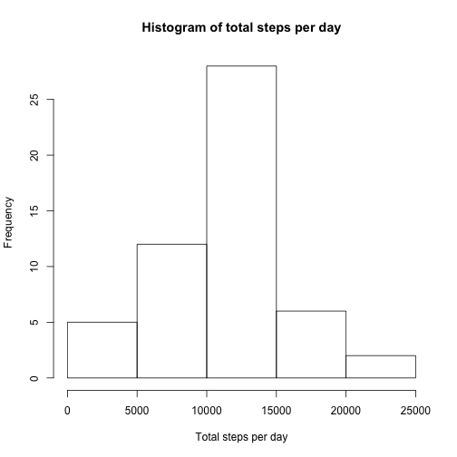
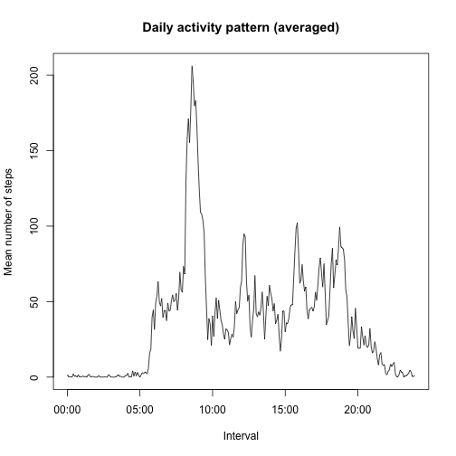
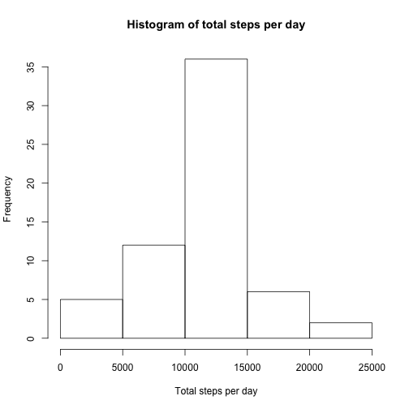

## Loading and preprocessing the data

Load the CSV data and convert the 'date' column to Date format:


```r
activity <- read.csv('activity.csv', sep = ',')
activity$date <- as.Date(activity$date)
```

## What is mean total number of steps taken per day?

Sum the number of steps for each date, ignoring the missing values:


```r
total_steps_per_day <- tapply(activity$steps,activity$date, sum, na.rm=TRUE)
```

Plot the histogram of total number of steps per day:

```r
hist(total_steps_per_day, xlab = "Total steps per day", 
     main = "Histogram of total steps per day")
```

 

Compute mean and median of total number of steps per day:


```r
mean(total_steps_per_day)
```

```
## [1] 9354.23
```

```r
median(total_steps_per_day)
```

```
## [1] 10395
```

## What is the average daily activity pattern?

Compute the mean number of steps for each interval, ignoring missing values:


```r
mean_steps_per_interval <- tapply(activity$steps,activity$interval, 
                                  mean, na.rm=TRUE)
```

Get the intervals for each day (12 five-mintues-intervals x 24 hours = 288 intervals):

```r
intervals <- activity$interval[1:288]
```

Now plot the mean number of steps per interval:


```r
plot(intervals, mean_steps_per_interval, type='l', 
     xlab='Interval', ylab='Mean number of steps', 
     main = "Daily activity pattern (averaged)")
```

 

Search for the interval with the maximum number of steps:


```r
max_interval <- which.max(mean_steps_per_interval)
mean_steps_per_interval[max_interval]
```

```
##      835 
## 206.1698
```

The interval with maximum number of steps is 835 (i.e. 08:35), with 206.1698113 steps.


## Imputing missing values

Look for missing values (NA) and calculate how many there are:


```r
nas <- activity$steps[is.na(activity)]
length(nas)
```

```
## [1] 2304
```

There are 2304 intervals with missing values.

The missing values will be replaced by the mean value of the given 5-minute interval. First replicate the vector with mean number of steps per interval, so that it has the same lenght as the activity data (61 days):


```r
repeated_means <- rep(mean_steps_per_interval, times=61)
```

Now copy the activity to a new dataset and assign these values only to missing entries:


```r
new_activity <- activity
new_activity[is.na(activity)] <- repeated_means[is.na(activity)]
```

Sum the number of steps for each date in the new dataset:


```r
total_steps_per_day_new <- tapply(new_activity$steps,new_activity$date, sum)
```

Plot the histogram of total number of steps per day:

```r
hist(total_steps_per_day_new, xlab = "Total steps per day", main = "Histogram of total steps per day")
```

 

Compute mean and median of new dataset:


```r
mean(total_steps_per_day_new)
```

```
## [1] 10766.19
```

```r
median(total_steps_per_day_new)
```

```
## [1] 10766.19
```

These values differ from the mean and median when missing values were ignored. **This shows that one has to be careful when replacing missing values!** 

## Are there differences in activity patterns between weekdays and weekends?

Create the factor variable indicating whether a given day is weekday or weekend:


```r
new_activity$day_type <- factor(weekdays(new_activity$date) %in% c("Saturday","Sunday"),
                                labels = c("weekday", "weekend"))
```

Compute the mean number of steps for each interval, for weekdays and weekends:


```r
mean_steps_per_interval_weekday <- tapply(new_activity$steps[new_activity$day_type=='weekday'],
                                          new_activity$interval[new_activity$day_type=='weekday'],
                                          mean)

mean_steps_per_interval_weekend <- tapply(new_activity$steps[new_activity$day_type=='weekend'],
                                          new_activity$interval[new_activity$day_type=='weekend'], 
                                          mean)
```

Create two data frames containing each interval, its mean number of steps, and the type of day (weekday or weekend) and combine them (rbind) into a new single data frame:


```r
df_weekdays <- data.frame("interval" = intervals, 
                          "mean_steps" = mean_steps_per_interval_weekday, 
                          "day_type" = "weekday")

df_weekends <- data.frame("interval" = intervals, 
                          "mean_steps" = mean_steps_per_interval_weekend, 
                          "day_type" = "weekend")

df_mean_steps <- rbind(df_weekdays,df_weekends)
```

Plot the time series of average number of steps per interval, split by day type:


```r
library(lattice)
xyplot(mean_steps ~ interval | day_type, data = df_mean_steps, 
       type="l", layout=c(1,2), xlab = "Interval", ylab = "Number of steps",
       main = "Daily activity pattern (averaged)")
```

 
